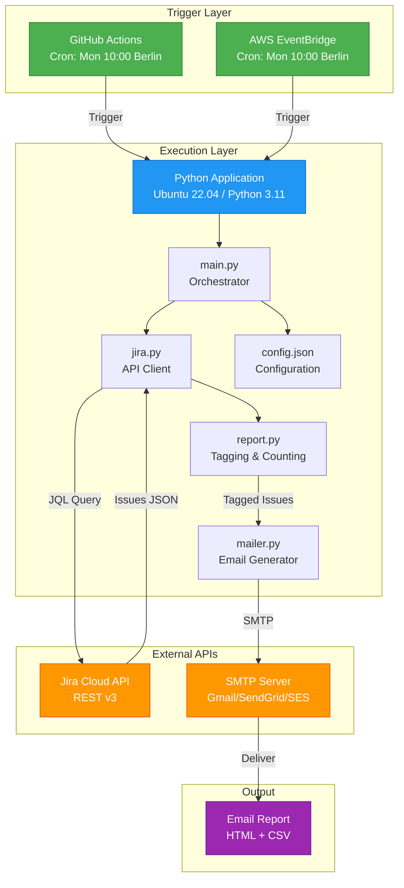
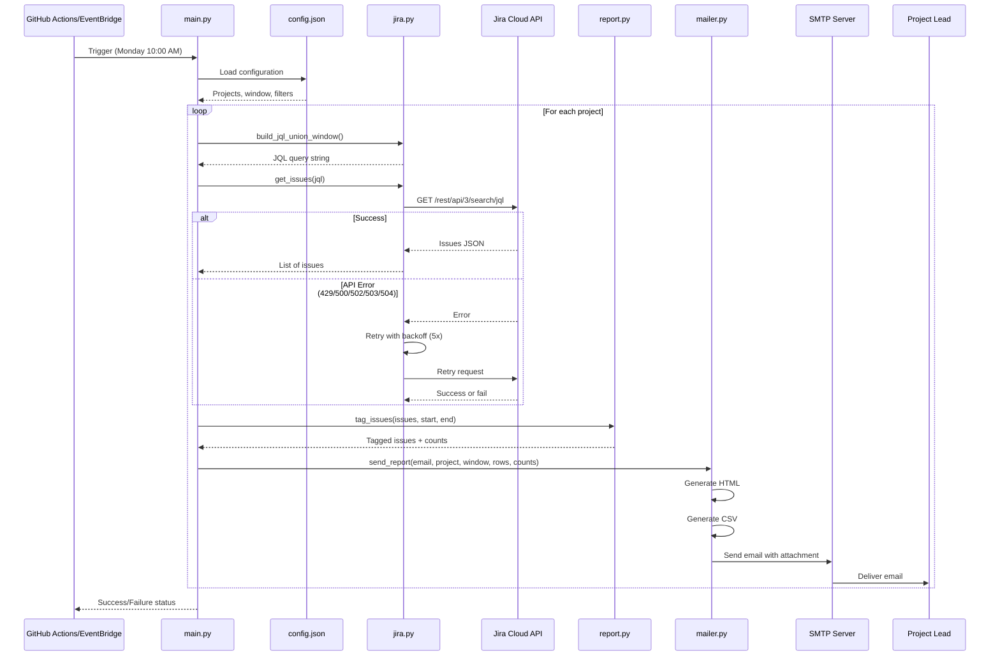
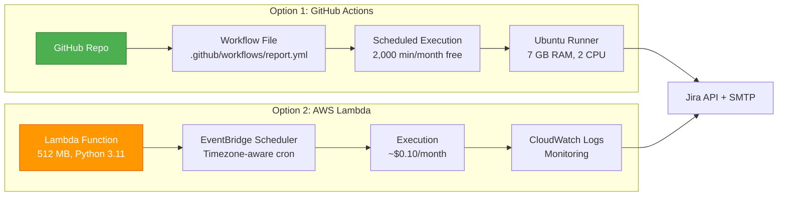
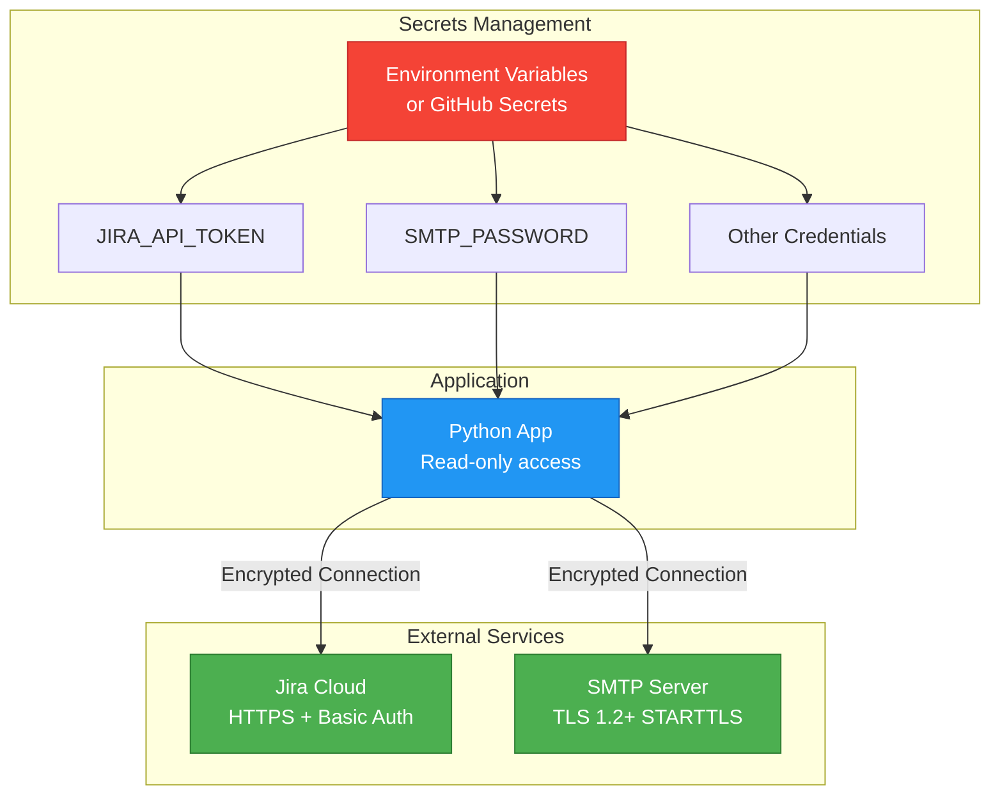
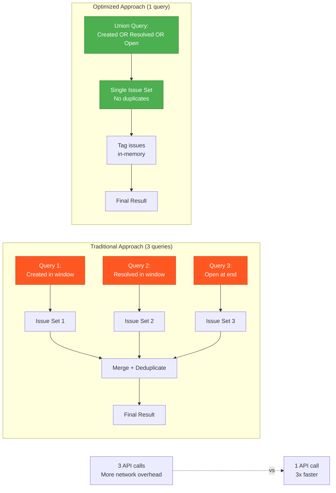

# Architecture Diagram (Mermaid)

## System Architecture



## Data Flow Sequence



## Deployment Options



## Security Architecture



## JQL Query Optimization



---

## How to View Diagrams

These Mermaid diagrams can be viewed by:

1. **GitHub**: Automatically rendered in GitHub README.md
2. **VS Code**: Install "Markdown Preview Mermaid Support" extension
3. **Online**: Paste code into https://mermaid.live
4. **Export**: Use Mermaid CLI to generate PNG/SVG images

Example command to export:
```bash
npm install -g @mermaid-js/mermaid-cli
mmdc -i architecture.md -o architecture.png
```
